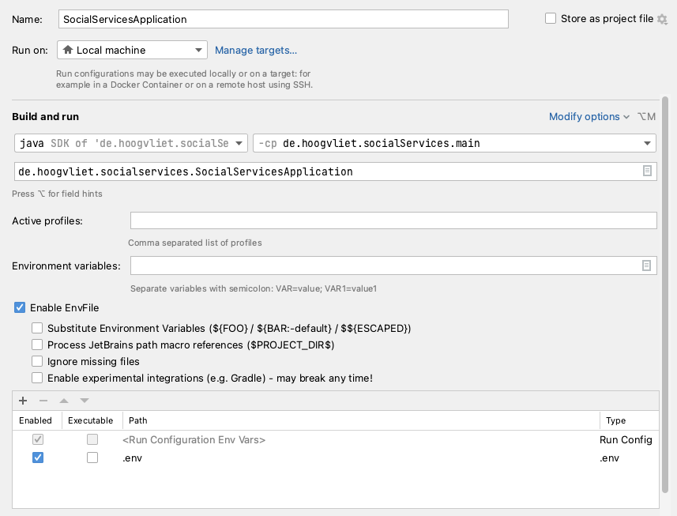

# Social Services online

Build an application that shows services in Berlin (and anywhere else) as easy and supportive as possible

## First steps
Make a copy of env.template with the most important env vars:

    cp env.template .env

To get backend application running:

    cp application.properties.template application.properties

With

    docker-compose up -d

you can see interaction between back- and frontend:

    http://localhost:3100

I centralize  properties in .env file. This can be used by docker and backend.

Unfortunately, IntelliJ doesn't include .env automatically. I decided to use a plug-in for
this problem:

    https://plugins.jetbrains.com/plugin/7861-envfile

To use this plugin, go to "Edit Configurations…" and to the start of your application. See this
example:

## Backend
